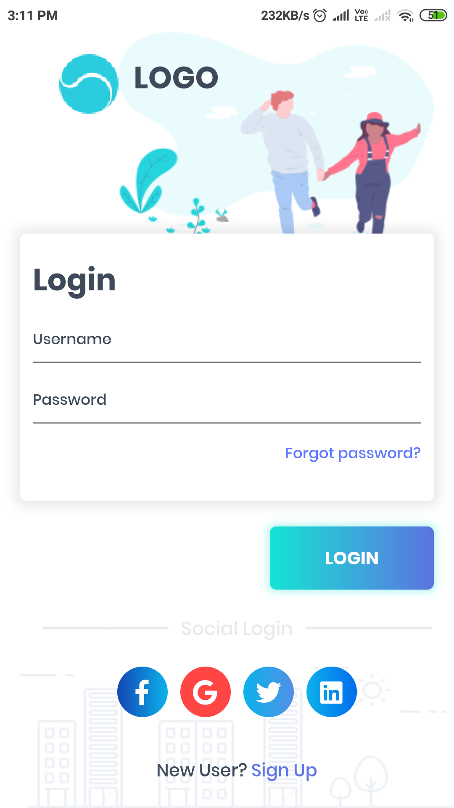

# FlutterBlog
[Flutter UI design & tutorials](https://diveintoflutter.blogspot.com)

## Check out other Flutter projects and UI design.
1. [Amazon UI Redesign](https://github.com/follow2vivek/FlutterBlog/tree/master/amazon_clone) & [Tutorial](https://diveintoflutter.blogspot.com/2019/05/flutter-amazon-redesign-reference-uplabs.html)

2. [Login UI design](https://github.com/follow2vivek/FlutterBlog/tree/master/flutter_uplab_login_ui) & [Tutorial](https://diveintoflutter.blogspot.com/2019/05/flutter-uplabs-login-ui-design.html)

3. [Flutter Tab Animation](https://github.com/follow2vivek/FlutterBlog/tree/master/flutter_animated_tab) & [Tutorial](https://diveintoflutter.blogspot.com/2019/05/flutter-animated-tab-from-scratch.html)

4. [Payment UI Design](https://github.com/follow2vivek/FlutterBlog/tree/master/smart_pay_ui) & [Tutorial](#)
